# Criando um Jogo

Neste documento iremos aprender o passo a passo para criar o nosso jogo,
partindo da interação com a interface gráfica.

O jogo será na vertical ou horizontal, onde as bordas matam o jogador, tendo
uma pista principal e uma imagem de fundo. Além disso, teremos o personagem
principal, os obstáculos e os colecionáveis.

## Informações gerais do jogo

Agoara, iremos ver a aba jogo. Dentro dessa aba é possível editar algumas
informaões para personalizar a criação do game, podemos editar o nome do jogo,
em azul o nome do autor, além disso podemos adicionar um ícon e uma descrição
para complementar, cada aba a ser editada aparece na sequência de imagens
abaixo.

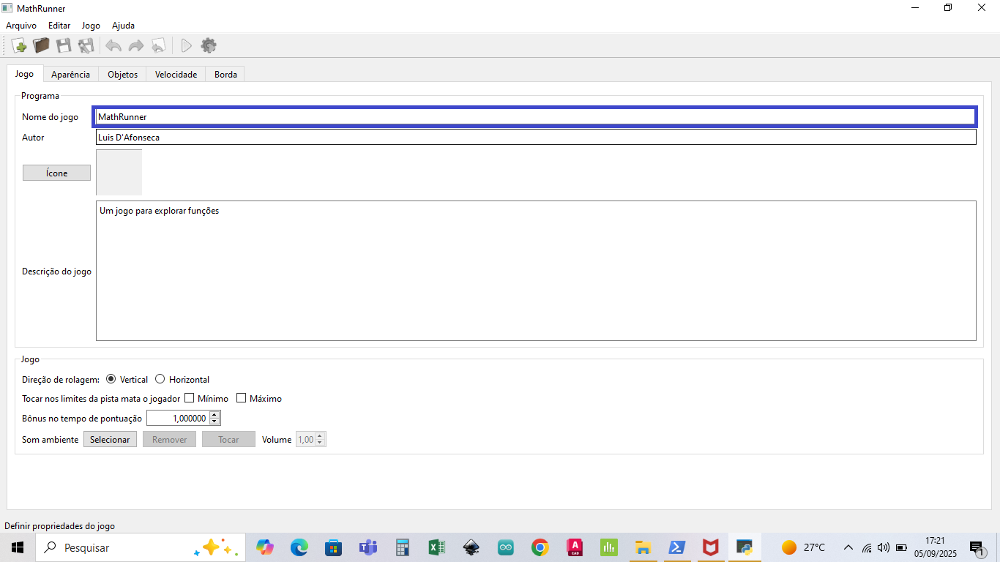

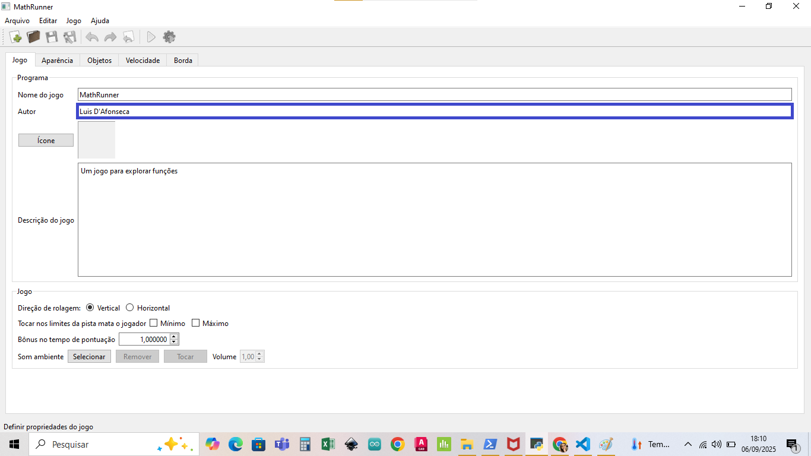

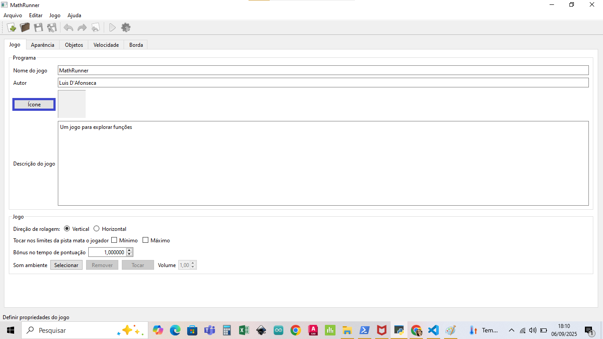

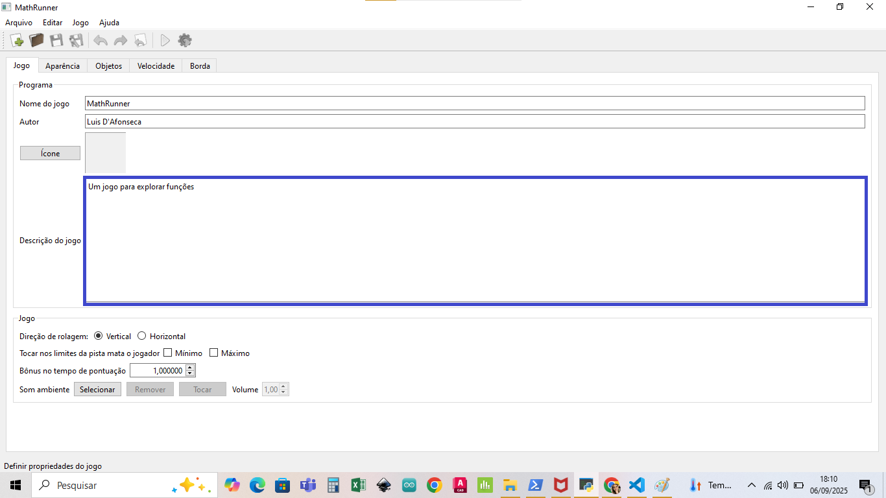

Nas imagens acima temos pré estabelicidos o nome do autor, descrição e nome do
jogo, que você poderá alterar. O arquivo para adicionar o icone estará na pasta
"Criando um jogo", na subpasta icone.

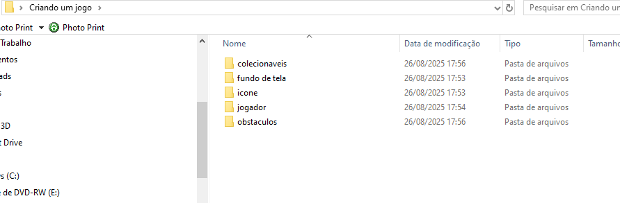

Agora passaremos pelas outras abas presentes na interface, sendo elas:
aparência, objetos, velocidade e borda, cada uma delas traz consigo uma forma
de personalizar o game criado.

## Aparência do jogo

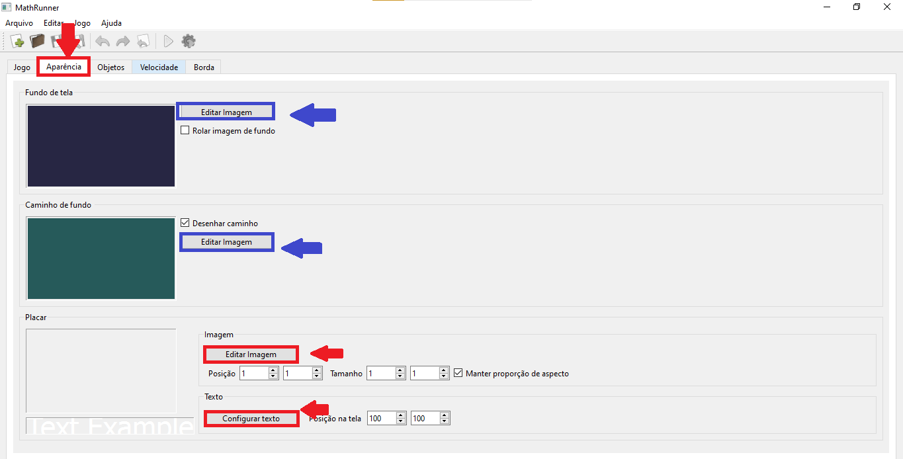

Agora, iremos falar sobre a aparência que criaremos para o jogo, tendo como
principais pontos o fundo de tela, o caminho de fundo e o placar. Todos esses
pontos podem ser editados e alterados, basta clicar em "Editar Imagem". Ao
clicar em "Editar Imagem" o explorador de arquivos será aberto e dentro dele
você escolherá uma pasta que contenha a imagem que deseja e a selecionará. No
exemplo abaixo criamos uma pasta "Criando jogo" onde há mais pastas com as
imagens para que você selecione. Como mostrado abaixo.

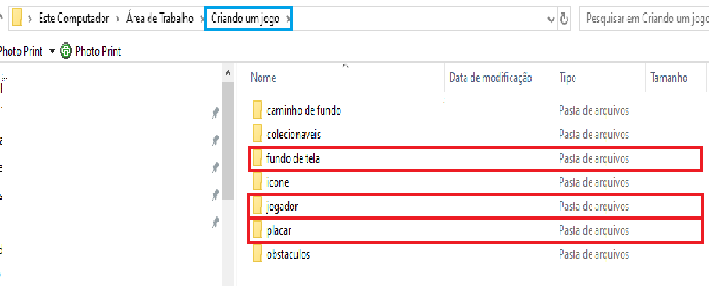

A terceira aba da interface se trata dos Objetos, que possue mais três ramos,
Objetos Jogador, Objetos Obstáculos e Objetos Colecionáveis, mostraremos cada
uma a seguir.

## Objetos do jogo

### Criando o jogador

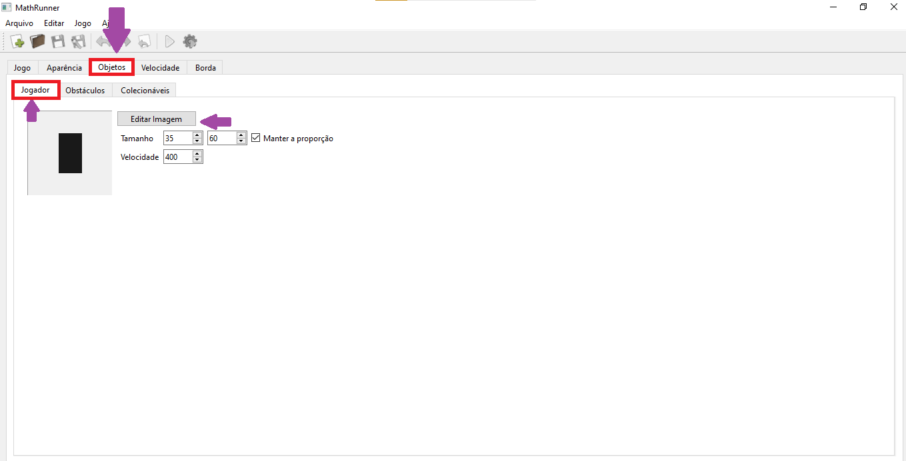

Ao clicar e objetos e depois jogador indicados pela seta roxa, poderemos editar
a imagem para selecionar a imagem do jogador. Para isso ao clicar em "Editar
Imagem" será aberto o explorador de arquivos assim como ocorreu anteriormente
ao selecionar a pasta "Criando Jogo". Abaixo termos a imagem ilustrativa, onde
selecionamos jogador.

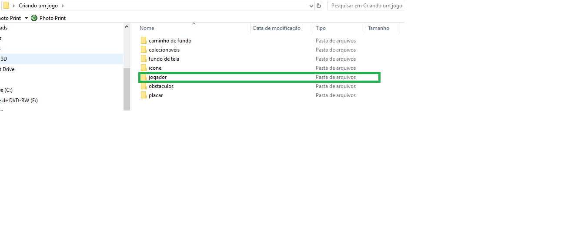

O mesmo será feito para as demais ramos, Objetos Obstáculos e Objetos
Colecionáveis. Veja abaixo.

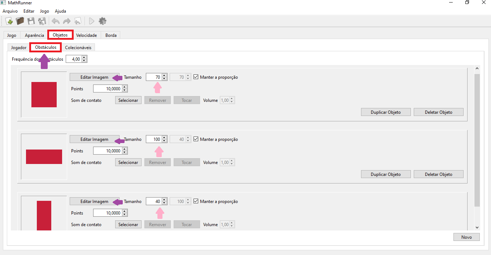

### Criando os obstáculos

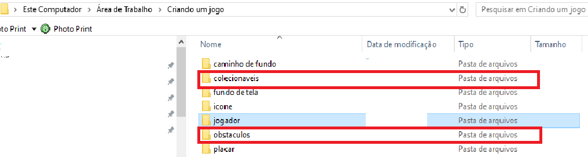

### Definindo a velocidade do jogo

Agora, poderemos editar a velocidade do jogador que será dada por uma função,
vale lembrar que a função não poderá ser negativa, pois ela dependerá do tempo
medido em segundos. Um exemplo de função seria : $$ f(t) = 10 + 2*t $$ A
escolha é do criador do jogo, podemos inserir conforme a imagem abaixo. 

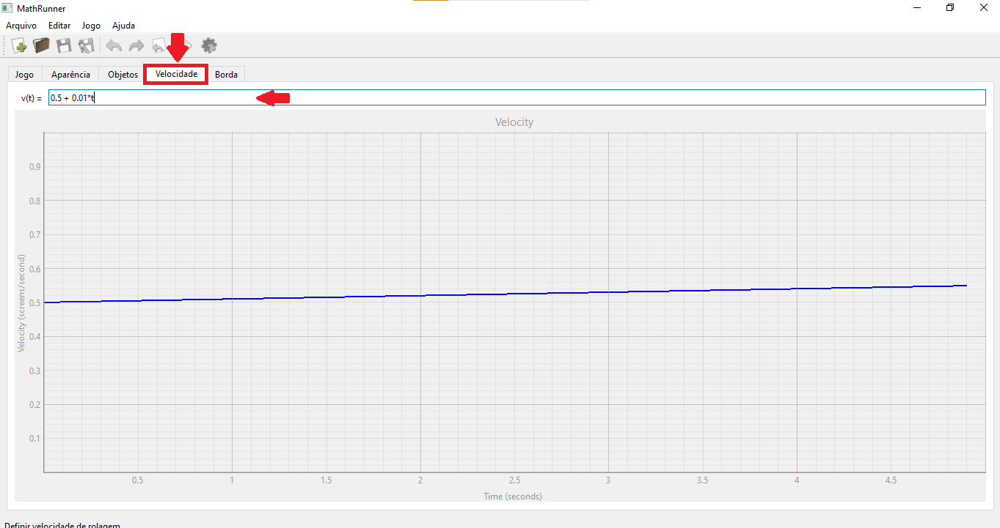

### Definindo as margens da pista

Para finalizar a criação do jogo, iremos editar a borda, para isso entraremos
na aba: Borda.

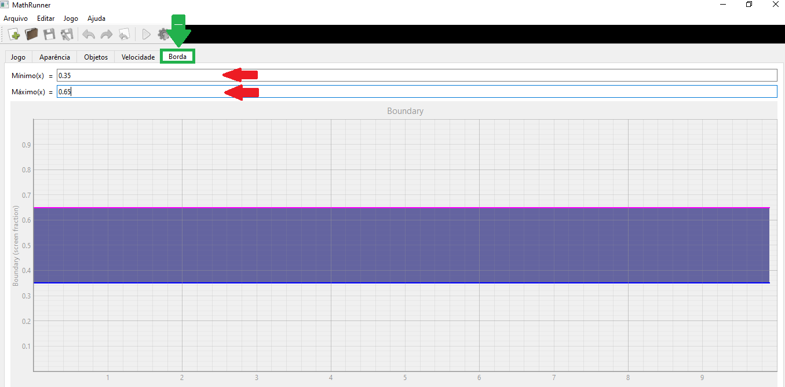

Podemos editar o máximoo e mínimo indicados pela seta vermelho.

O máximo e mínimo definirão se o jogo será horizontal ou vertical, a margem de
cima representa a direita e a margem de baixo a esquerda. Além disso as
margerns serão dados pelos desenhos dos gráficos de funções de $x$;

## Executando o jogo

Para iniciar o jogo apertaremos no play, localizado no canto superior esquedo
da interface.

Os controles do jogos serão:
Mover para esquerda, apertaremos seta para esquerda ou A.

Mover para direita, apertaremos seta para direita ou D.

Pausar, apertaremos F1, H ou espaço.

Alterar mudo, apertaremos M.

Alterar música apertaremos N.

Ajustar volume + e -

Sair apertaremos Q ou Esc.

## Principais funções matemáticas

### Raiz quadrada e módulo 

`raiz(a)` ou `sqrt(a)`

`módulo(a)` ou `abs(a)`

### Mínimo e máximo

`min(a,b)`

`max(a,b)`

### Exponenciais e Logaritmos

`exp(a)`

`ln(a)` ou `log(a)`

`log10(a)`

### Trigonométricas

`sen(a)` ou `sin(a)`

`cos(a)`

`tg(a)` ou `tan(a)`

`arcsen(a)` ou `arcsin(a)`

`arccos(a)`

`arctg(a)` ou `arctan(a)`

### Hiperbólicas

`senh(a)` ou `sinh(a)`

`cosh(a)`

`tgh(a)` ou `tanh(a)`

`arcsenh(a)` ou `arcsinh(a)`

`arccosh(a)`

`arctgh(a)` ou `arctanh(a)`

